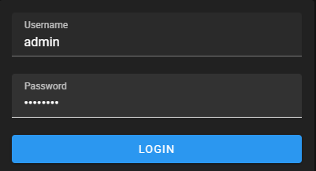
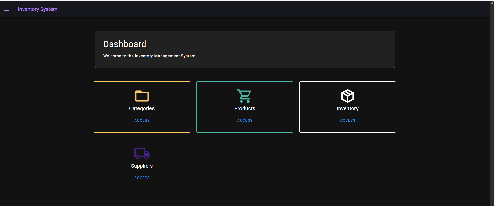
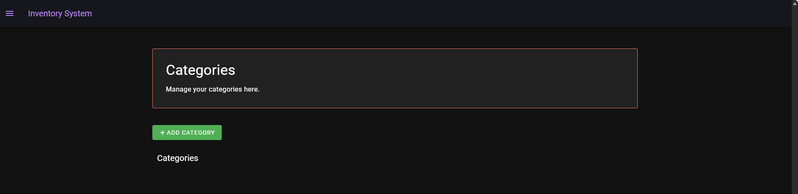
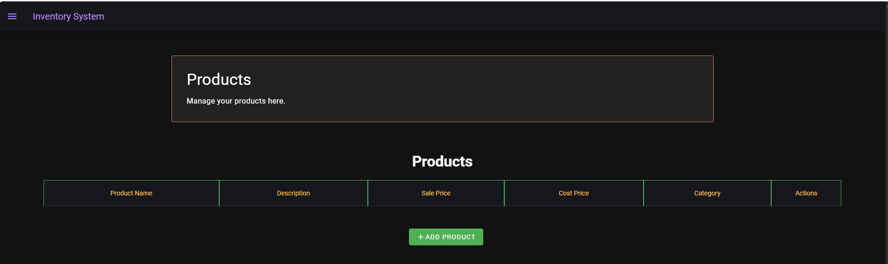
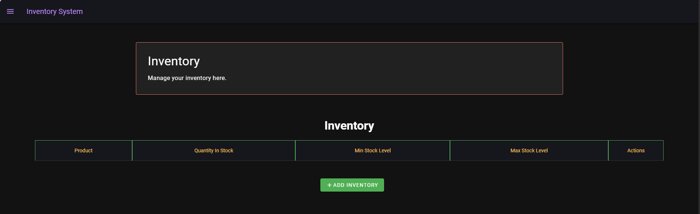
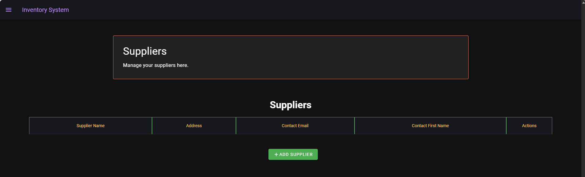

# 🖥️ Inventory System UI

The **Inventory System UI** is a Nuxt 3 single-page web application that allows users to manage
inventory-related data through a secure, authenticated interface.

It provides a clean and consistent user experience for managing:

- Product categories
- Products
- Inventory stock levels
- Suppliers
- High-level operational overview via dashboard

This documentation focuses on **how to run the UI** and a **user experience walkthrough**
(with screenshot placeholders you will populate).

---

## 🚀 Tech Stack

- **Framework:** Nuxt 3 (Vue 3 + Composition API)
- **UI Library:** Vuetify
- **Styling:** Vuetify + utility classes
- **API Integration:** `$fetch` (Nuxt native)
- **Authentication:** JWT (Bearer token)
- **State Handling:** Local storage (auth token)

---

## ▶️ Setup & Run

### Prerequisites

- Node.js 18+
- npm or yarn
- Inventory System API running locally

### Install dependencies

```sh
npm install
```
---
## Run the UI locally

```sh
npm run dev
```
The application will be available at:
```arduino
http://localhost:3000
```
---

## 🔑 Test Login Details
Use the following credentials to log in:

| Username               | Password | Description          |
|---------------------|----------|----------------------|
| admin| admin123 | Primary demo user    |

---

## 🔑 Authentication & Test Login
 
The UI depends on the Inventory System API being available. Ensure the backend is running before logging in.
There is no self-registration in this version.
Users are authenticated using JWT tokens issued by the backend.
Login Flow
- User enters credentials
- Backend returns JWT
- Token stored in localStorage
- All API requests include:

```makefile
Authorization: Bearer <token>
```
Routes are protected using a global Nuxt auth middleware.
---
### 1️⃣ Login Page

- User authenticates to access the banking dashboard
- Validation messaging for incorrect login attempts



---

### 2️⃣ Dashboard
The dashboard provides a high-level overview of the system.

Displays:

- Summary cards (counts of categories, products, suppliers, inventory items)
- Quick navigation to key sections
- Clean landing experience after login



---
### 3️⃣ Categories Management

Allows users to manage product categories.

Features:

- List all categories
- Create new categories
- Edit existing categories
- Delete categories (where allowed)



---
### 4️⃣ Products Management

Used to manage products within the system.
Features:

- View all products
- Assign products to categories
- Create and edit products
- Delete products
- View product details



---
### 5️⃣ Inventory Management

Provides visibility into stock levels and inventory records.
Features:
- View inventory items
- Track quantities per product
- Update stock levels
- Link inventory records to products

  

---
### 6️⃣ Suppliers Management
Allows management of suppliers associated with products.

Features:
- View suppliers
- Create new suppliers
- Edit supplier details
- Remove suppliers

  
---
### 🔐 Route Protection

- All pages except /login are protected
- Unauthorized users are redirected to /login
- Token presence is validated client-side
- API enforces JWT validation server-side
